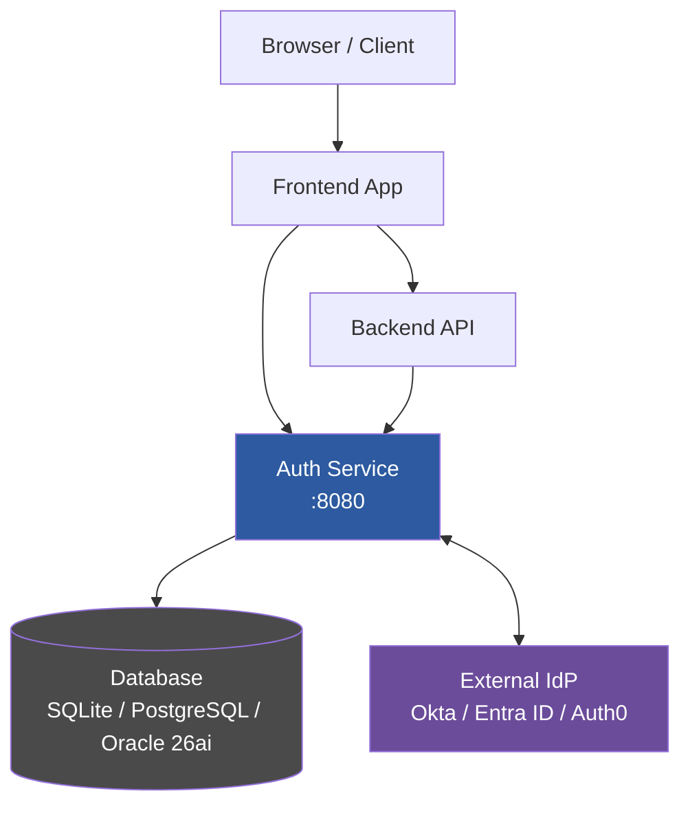
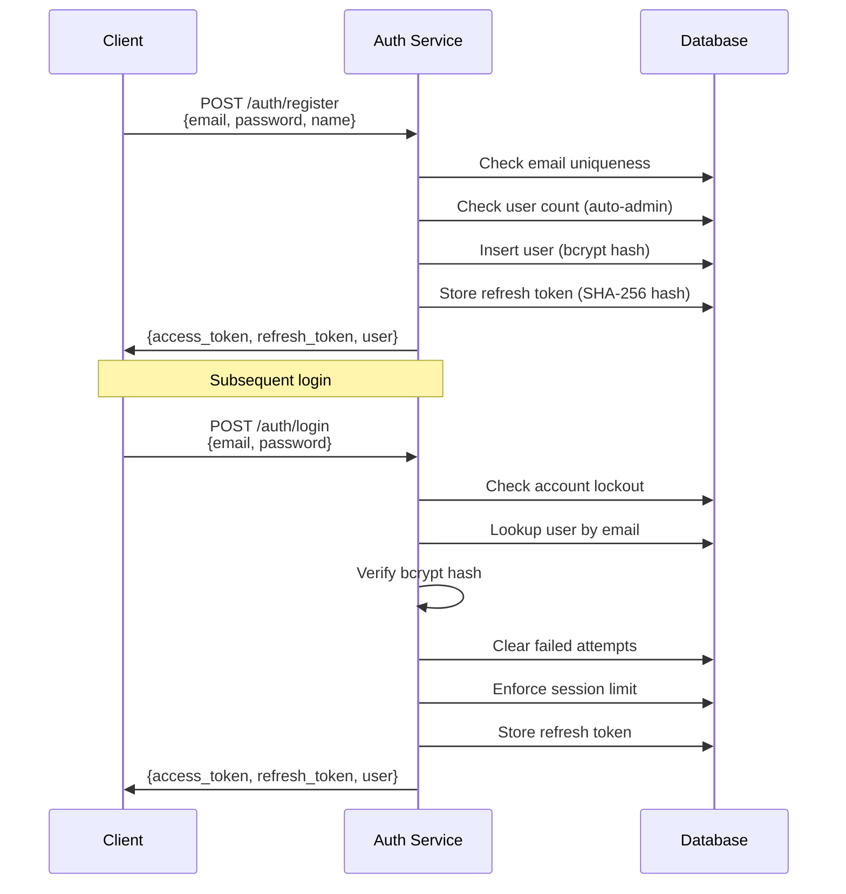
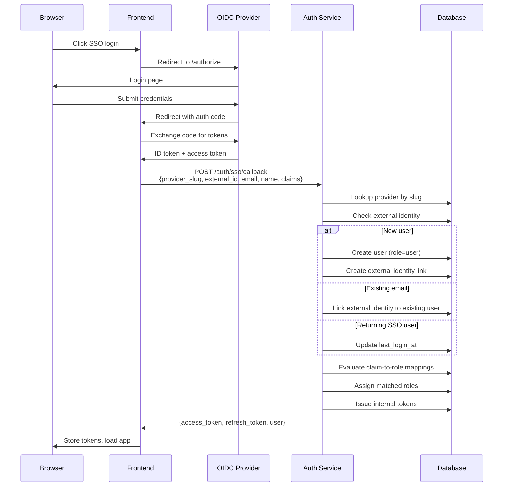
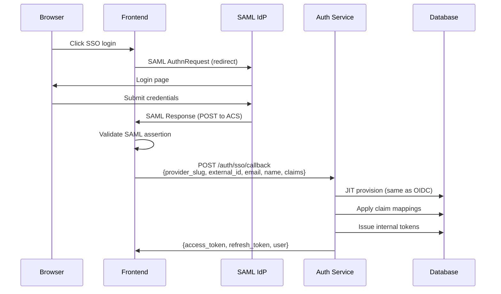
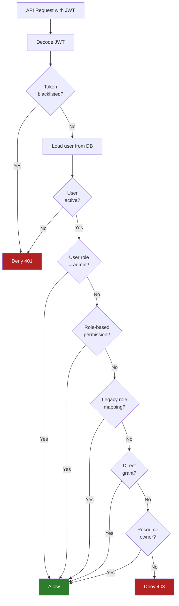
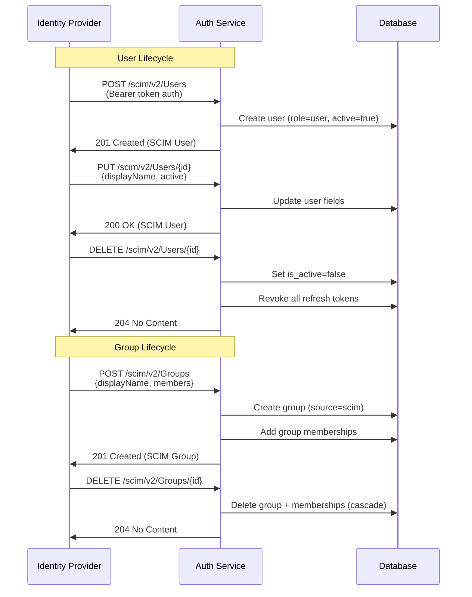
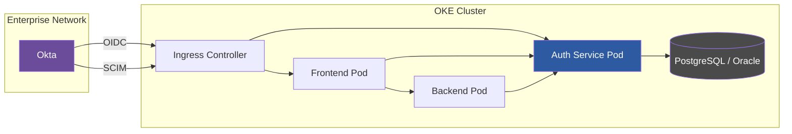
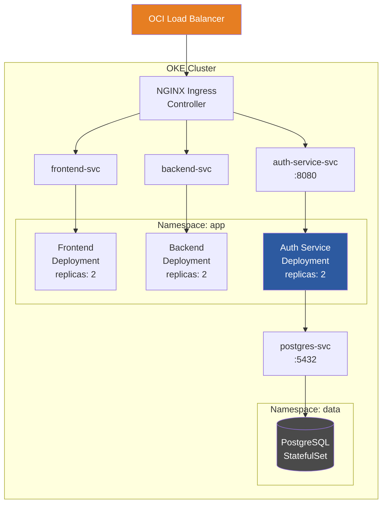

# Architecture

This document describes the system architecture, authentication and authorization flows, and deployment topology for the Enterprise Auth Service.

## High-Level Architecture

The auth service operates as a sidecar microservice alongside the main application frontend and backend. It owns all identity, authentication, and authorization concerns.

### Component Responsibilities

| Component | Responsibility |
|-----------|---------------|
| **Auth Service** | User registration, login, JWT issuance, token refresh/revocation, RBAC evaluation, SSO (OIDC/SAML), SCIM provisioning, audit logging |
| **Frontend** | Stores JWT in memory/localStorage, attaches `Authorization: Bearer` header to API calls, redirects to IdP for SSO |
| **Backend** | Validates JWT signature and expiry, calls auth service for permission checks when needed |
| **Database** | Stores users, roles, permissions, tokens, providers, groups, and audit logs |
| **External IdP** | Authenticates users via OIDC or SAML, pushes user/group changes via SCIM |

## Authentication Flows

### Local Authentication

### OIDC Authentication

### SAML Authentication

## Authorization Flow

## SCIM Provisioning Flow

## Enterprise Integration Example

This diagram shows a typical enterprise deployment where Okta is used as the identity provider with both OIDC (for interactive login) and SCIM (for directory sync).

**Flow:**

1. **SCIM (background)**: Okta pushes user and group changes to `/scim/v2/*` endpoints. Users are created/deactivated automatically. Groups are synced.
2. **OIDC (interactive)**: Users click "Sign in with Okta" in the frontend. The OIDC flow authenticates the user, and the auth service issues internal tokens via JIT provisioning.
3. **Claim mapping**: Okta group memberships (sent as claims) are mapped to internal RBAC roles. For example, the "Platform-Admin" Okta group maps to the internal `admin` role.
4. **Authorization**: The backend validates JWT tokens and calls the permission check API when fine-grained access control is needed.

## Deployment Topology on OKE

### Key Design Decisions

- **Stateless service**: The auth service stores all state in the database. Horizontal scaling is achieved by adding replicas.
- **Sidecar pattern**: The auth service runs alongside the application rather than as a centralized gateway, reducing latency and blast radius.
- **Token-based auth**: JWTs are self-contained and can be validated by any service without calling back to the auth service. Only permission checks and token revocation require a call to the auth service.
- **Feature flags**: Unused features (OIDC, SAML, SCIM) can be disabled to reduce attack surface in simpler deployments.
- **Database flexibility**: The same codebase supports SQLite (development), PostgreSQL (standard production), and Oracle 26ai (enterprise production) via auto-detection.
