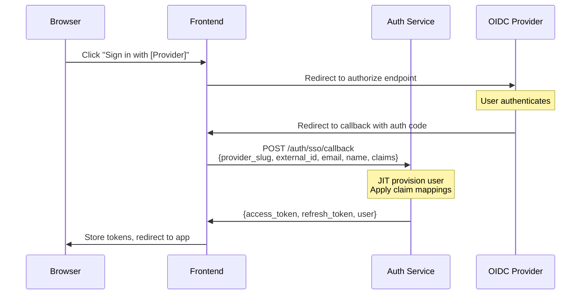
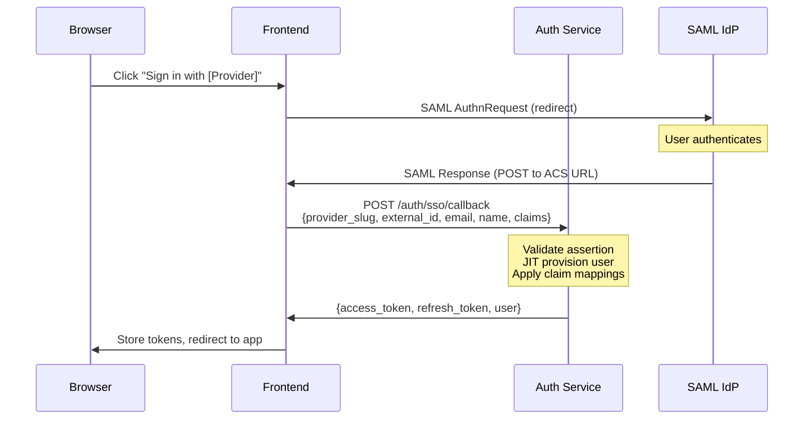

# OIDC and SAML Single Sign-On

This guide covers federated authentication via OpenID Connect (OIDC) and SAML 2.0. Both protocols follow the same internal pattern: the external identity provider authenticates the user, the auth service performs Just-In-Time (JIT) provisioning, applies claim-to-role mappings, and issues internal JWT tokens.

## Prerequisites

- Auth service running with `AUTH_OIDC_ENABLED=true` (for OIDC) or `AUTH_SAML_ENABLED=true` (for SAML)
- An admin user to create identity provider configurations
- The external identity provider (Okta, Entra ID, Auth0, etc.) configured with the appropriate redirect/callback URLs

## OIDC Flow

The OIDC authorization code flow works as follows:



### How It Works

1. The frontend redirects the user to the OIDC provider's authorization endpoint with the configured `client_id`, `redirect_uri`, `scope`, and `response_type=code`.
2. The user authenticates at the identity provider.
3. The provider redirects back to the frontend callback URL with an authorization code.
4. The frontend (or a backend-for-frontend) exchanges the code for tokens at the provider's token endpoint, extracts the ID token claims, and sends them to the auth service's SSO callback.
5. The auth service performs JIT provisioning, applies claim-to-role mappings, and returns internal access and refresh tokens.

## SAML Flow

The SAML 2.0 SP-initiated flow:



### How It Works

1. The frontend generates a SAML AuthnRequest and redirects the user to the IdP's SSO URL.
2. The user authenticates at the identity provider.
3. The IdP posts a SAML Response to the Assertion Consumer Service (ACS) URL.
4. The frontend (or ACS handler) validates the SAML assertion, extracts the attributes, and sends them to the auth service's SSO callback.
5. The auth service performs JIT provisioning, applies claim-to-role mappings, and returns internal access and refresh tokens.

## Provider Configuration

Identity providers are managed via the `/auth/providers` API. Each provider has a `type` (oidc or saml), a unique `slug`, and a `config` JSON object containing provider-specific settings.

### OIDC Config Structure

```json
{
  "client_id": "your-client-id",
  "client_secret": "your-client-secret",
  "authorize_url": "https://idp.example.com/oauth2/authorize",
  "token_url": "https://idp.example.com/oauth2/token",
  "userinfo_url": "https://idp.example.com/oauth2/userinfo",
  "jwks_uri": "https://idp.example.com/oauth2/keys",
  "scopes": ["openid", "profile", "email"],
  "redirect_uri": "https://your-app.com/auth/callback"
}
```

### SAML Config Structure

```json
{
  "idp_entity_id": "https://idp.example.com/saml",
  "idp_sso_url": "https://idp.example.com/saml/sso",
  "idp_certificate": "-----BEGIN CERTIFICATE-----\n...\n-----END CERTIFICATE-----",
  "sp_entity_id": "https://your-app.com/saml/metadata",
  "acs_url": "https://your-app.com/auth/saml/acs",
  "name_id_format": "urn:oasis:names:tc:SAML:1.1:nameid-format:emailAddress"
}
```

### Creating a Provider

```bash
# Create an OIDC provider
curl -X POST http://localhost:8080/auth/providers \
  -H "Authorization: Bearer $ADMIN_TOKEN" \
  -H "Content-Type: application/json" \
  -d '{
    "type": "oidc",
    "name": "Okta Production",
    "slug": "okta-prod",
    "config": {
      "client_id": "0oabc123",
      "client_secret": "secret-value",
      "authorize_url": "https://company.okta.com/oauth2/default/v1/authorize",
      "token_url": "https://company.okta.com/oauth2/default/v1/token",
      "userinfo_url": "https://company.okta.com/oauth2/default/v1/userinfo",
      "scopes": ["openid", "profile", "email", "groups"]
    },
    "is_active": true,
    "priority": 10
  }'
```

```bash
# Create a SAML provider
curl -X POST http://localhost:8080/auth/providers \
  -H "Authorization: Bearer $ADMIN_TOKEN" \
  -H "Content-Type: application/json" \
  -d '{
    "type": "saml",
    "name": "Entra ID SAML",
    "slug": "entra-saml",
    "config": {
      "idp_entity_id": "https://sts.windows.net/tenant-id/",
      "idp_sso_url": "https://login.microsoftonline.com/tenant-id/saml2",
      "idp_certificate": "MIIC8D...",
      "sp_entity_id": "https://your-app.com",
      "acs_url": "https://your-app.com/auth/saml/acs"
    },
    "is_active": true,
    "priority": 5
  }'
```

## Claim-to-Role Mapping

Claim mappings let you automatically assign internal roles based on claims (attributes) from the external identity provider. Mappings are evaluated in descending priority order, and the first match per claim key wins.

### Matching Modes

- **Exact match** (`is_regex: false`): The claim value must exactly equal the `claim_value_pattern`.
- **Regex match** (`is_regex: true`): The `claim_value_pattern` is treated as a regular expression and matched against the claim value using `re.search`.

### Priority

Mappings with higher `priority` values are evaluated first. If a user's claims match multiple mappings for the same claim key, only the highest-priority match is applied.

### List Claim Values

If a claim value is a list (e.g., `"groups": ["Engineering", "DevOps"]`), each element is tested individually against the mapping pattern.

### Creating a Claim Mapping

```bash
# Map Okta group "Engineering" to the internal "user" role (assume role_id=2)
curl -X POST http://localhost:8080/auth/providers/1/mappings \
  -H "Authorization: Bearer $ADMIN_TOKEN" \
  -H "Content-Type: application/json" \
  -d '{
    "claim_key": "groups",
    "claim_value_pattern": "Engineering",
    "role_id": 2,
    "priority": 10,
    "is_regex": false
  }'
```

```bash
# Map any group matching "Admin*" to the internal "admin" role (assume role_id=1)
curl -X POST http://localhost:8080/auth/providers/1/mappings \
  -H "Authorization: Bearer $ADMIN_TOKEN" \
  -H "Content-Type: application/json" \
  -d '{
    "claim_key": "groups",
    "claim_value_pattern": "^Admin.*",
    "role_id": 1,
    "priority": 20,
    "is_regex": true
  }'
```

## JIT Provisioning Behavior

When the auth service receives an SSO callback, it performs Just-In-Time provisioning:

### New User (no matching external identity or email)

1. A new user record is created with `role=user` and `password_hash="!sso-only"` (cannot log in with a password).
2. An external identity record is created linking the user to the provider and external ID.
3. Claim-to-role mappings are evaluated and matching roles are assigned.

### Existing External Identity (returning SSO user)

1. The `last_login_at` and `raw_claims` fields on the external identity are updated.
2. The linked user record is returned.
3. Claim-to-role mappings are re-evaluated (new role assignments are additive; existing ones are not removed).

### Existing Email (account linking)

If a local user already exists with the same email address but has no external identity for this provider:

1. An external identity record is created linking the existing user to the provider.
2. The existing user record is returned (preserving their current role and permissions).
3. Claim-to-role mappings are evaluated and additional roles may be assigned.

## Token Bridge

After SSO authentication and JIT provisioning, the auth service issues internal tokens:

1. An **access token** (JWT) is created with the user's ID, email, role, and name. It expires according to `AUTH_ACCESS_TOKEN_EXPIRE_MINUTES`.
2. A **refresh token** (opaque, stored hashed in the database) is created, expiring according to `AUTH_REFRESH_TOKEN_EXPIRE_DAYS`.

These tokens are identical in format to those issued by local login. Downstream services validate the JWT without knowing whether the user authenticated via local credentials or SSO.

## Managing Providers

### List all providers

```bash
curl http://localhost:8080/auth/providers \
  -H "Authorization: Bearer $ADMIN_TOKEN"
```

### Update a provider

```bash
curl -X PATCH http://localhost:8080/auth/providers/1 \
  -H "Authorization: Bearer $ADMIN_TOKEN" \
  -H "Content-Type: application/json" \
  -d '{"is_active": false}'
```

### Delete a provider

```bash
curl -X DELETE http://localhost:8080/auth/providers/1 \
  -H "Authorization: Bearer $ADMIN_TOKEN"
```

### List claim mappings for a provider

```bash
curl http://localhost:8080/auth/providers/1/mappings \
  -H "Authorization: Bearer $ADMIN_TOKEN"
```

### Delete a claim mapping

```bash
curl -X DELETE http://localhost:8080/auth/providers/1/mappings/3 \
  -H "Authorization: Bearer $ADMIN_TOKEN"
```
